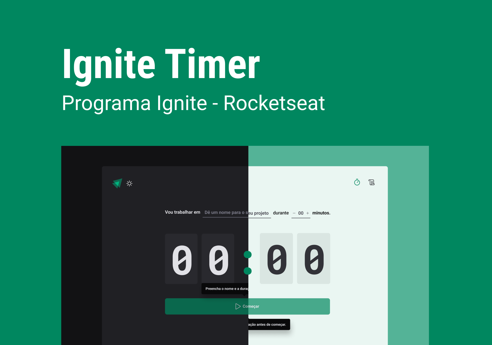

# Ignite Timer

<p align="center">
  
  
</p>
<br>

O Ignite Timer é um web app que permite a criação de ciclos para suas tarefas. Os ciclos de atividade criados são salvos no local storage do seu navegador, desse modo, é possível recarregar a página ou até mesmo reabrir a janela do navegador, sem risco de perder o progresso do timer atual. Além disso é possível consultar um histórico dos ciclos já criados, e seus estados: concluído, interrompido ou em andamento.

Para essa aplicação foram implementados validação de fomulário, criação de contexto e reducer para controle do estado dos ciclos, roteamento das páginas, mudança de tema e controle de armazenamento local.

<div align="center">
  
</div>

## Extras

Foram adicionadas algumas funcionalidades além do proposto durante o ignite:

- [x] Tema light
- [x] Input numérico customizado
- [ ] Responsividade

## Getting Started

Para executar esse projeto será necessário ter o [Node.js](https://nodejs.org/) e o [npm](https://www.npmjs.com/) instalados.

Instale as dependências:

```shell
npm i
```

Inicie a aplicação:

```shell
npm run dev
```

## Tecnologias

- [date-fns](https://date-fns.org/)
- [ESLint](https://eslint.org/)
- [Immer](https://immerjs.github.io/immer/)
- [React Hook Form](https://react-hook-form.com/)
- [React Router](https://reactrouter.com/en/main)
- [ReactJS](https://reactjs.org/)
- [Styled Components](https://styled-components.com/)
- [Typescript](https://typescriptlang.org/)
- [Vite](https://vitejs.dev/)
- [Zod](https://zod.dev/)

## Licença

Este projeto está licenciado sob o MIT. Consulte a [licença](LICENSE) para mais informações.
